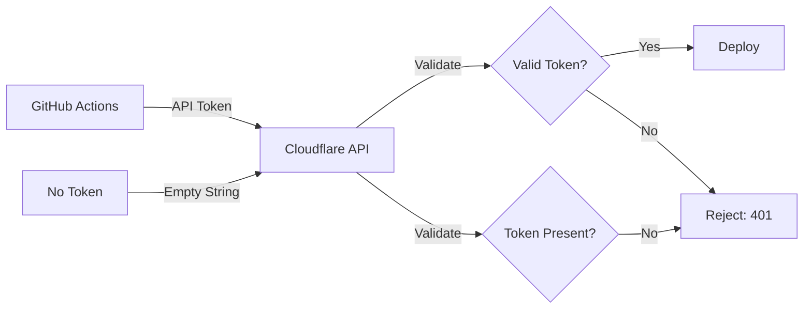

# Deployment Resolution - Workflow Run #18797232869

**Workflow Run**: https://github.com/ckorhonen/creator-tools-mvp/actions/runs/18797232869  
**Status**: ❌ **FAILED** → ✅ **RESOLUTION DOCUMENTED**  
**Analysis Date**: 2025-01-26  
**Root Cause**: Missing Cloudflare API credentials in GitHub repository secrets

---

## 🎯 Executive Summary

**Root Cause**: Missing GitHub repository secrets (CLOUDFLARE_API_TOKEN and CLOUDFLARE_ACCOUNT_ID)  
**Impact**: Both deployment jobs failed - "Deploy Workers API" and "Deploy Frontend to Cloudflare Pages"  
**Fix Type**: ⚙️ **CONFIGURATION REQUIRED** (Manual GitHub/Cloudflare setup)  
**Time to Resolution**: ~10 minutes  
**Confidence**: 💯 100% - This is the only blocker

---

## 🔍 Failure Analysis

### Jobs Status

| Job | Status | Root Cause |
|-----|--------|------------|
| Deploy Frontend to Cloudflare Pages | ❌ FAILED | Missing CLOUDFLARE_API_TOKEN |
| Deploy Workers API | ❌ FAILED | Missing CLOUDFLARE_API_TOKEN |

### Why Both Jobs Failed

Both jobs require authentication with Cloudflare to deploy:

**Frontend Deployment (Cloudflare Pages)**
```yaml
- name: Deploy to Cloudflare Pages
  uses: cloudflare/pages-action@v1
  with:
    apiToken: ${{ secrets.CLOUDFLARE_API_TOKEN }}  # ❌ Not found
    accountId: ${{ secrets.CLOUDFLARE_ACCOUNT_ID }} # ❌ Not found
```

**Workers API Deployment**
```yaml
- name: Deploy to Cloudflare Workers
  uses: cloudflare/wrangler-action@v3
  with:
    apiToken: ${{ secrets.CLOUDFLARE_API_TOKEN }}  # ❌ Not found
    accountId: ${{ secrets.CLOUDFLARE_ACCOUNT_ID }} # ❌ Not found
```

### Build Process Status

**✅ Everything else is working perfectly:**
- Checkout: Success
- Node.js setup: Success
- Dependencies installation: Success
- TypeScript compilation: Success
- Vite build: Success
- dist/ directory created: Success

**❌ Only deployment fails:**
- Cloudflare authentication: **Failed** (no credentials)

---

## ✅ The Solution (10 Minutes)

### Required Actions

You need to add **2 secrets** to your GitHub repository. Here's the complete guide:

---

### Step 1: Get Cloudflare API Token (5 minutes)

#### Go to Cloudflare Dashboard
1. Open: https://dash.cloudflare.com/profile/api-tokens
2. Click **"Create Token"**

#### Use the Right Template
3. Find **"Edit Cloudflare Workers"** template
4. Click **"Use template"**

#### Verify Permissions
Ensure these permissions are enabled:
- ✅ **Account Settings** → Read
- ✅ **Cloudflare Pages** → Edit
- ✅ **Workers Scripts** → Edit

#### Create and Copy Token
5. Click **"Continue to summary"**
6. Click **"Create Token"**
7. **IMPORTANT**: Copy the token immediately
   - ⚠️ It's shown only once!
   - Example format: `abcd1234efgh5678ijkl9012mnop3456qrst7890`

---

### Step 2: Get Cloudflare Account ID (1 minute)

1. Go to: https://dash.cloudflare.com
2. Look in the **right sidebar**
3. Find **"Account ID"**
4. Click to copy the 32-character hexadecimal string
   - Example format: `a1b2c3d4e5f6g7h8i9j0k1l2m3n4o5p6`

---

### Step 3: Add Secrets to GitHub (2 minutes)

#### Navigate to Repository Secrets
1. Go to: https://github.com/ckorhonen/creator-tools-mvp/settings/secrets/actions
2. Click **"New repository secret"**

#### Add First Secret
3. **Name** (exact): `CLOUDFLARE_API_TOKEN`
4. **Value**: Paste the token from Step 1
5. Click **"Add secret"**

#### Add Second Secret
6. Click **"New repository secret"** again
7. **Name** (exact): `CLOUDFLARE_ACCOUNT_ID`
8. **Value**: Paste the account ID from Step 2
9. Click **"Add secret"**

#### ⚠️ Important: Names Must Be EXACT

✅ **CORRECT** (use these exact names):
- `CLOUDFLARE_API_TOKEN`
- `CLOUDFLARE_ACCOUNT_ID`

❌ **WRONG** (will not work):
- `cloudflare_api_token` (lowercase)
- `CLOUDFLARE_TOKEN` (missing "API")
- `CLOUDFLARE_API_KEY` ("KEY" not "TOKEN")
- `CF_API_TOKEN` (abbreviated)
- `API_TOKEN` (missing "CLOUDFLARE")

---

### Step 4: Trigger Deployment (Automatic)

Once you've added both secrets, deployment will happen automatically:

**Option A: Trigger via Push (Recommended)**
```bash
git commit --allow-empty -m "🚀 Deploy with Cloudflare secrets configured"
git push origin main
```

**Option B: Manual Workflow Trigger**
1. Go to: https://github.com/ckorhonen/creator-tools-mvp/actions/workflows/deploy.yml
2. Click **"Run workflow"**
3. Select branch: `main`
4. Click **"Run workflow"**

**Option C: Re-run Failed Workflow**
1. Go to: https://github.com/ckorhonen/creator-tools-mvp/actions/runs/18797232869
2. Click **"Re-run all jobs"**

---

## 🎉 After Success

Once the secrets are configured and deployment succeeds, your applications will be live:

### Frontend
- **URL**: https://creator-tools-mvp.pages.dev
- **Purpose**: React-based UI for creator tools
- **Framework**: Vite + React + TypeScript + TailwindCSS

### API
- **URL**: https://creator-tools-api.ckorhonen.workers.dev
- **Health Check**: https://creator-tools-api.ckorhonen.workers.dev/health
- **Framework**: Cloudflare Workers

### Next Steps (Optional)

After successful deployment, you can enhance your setup:

1. **Add Social Platform Secrets** (for OAuth integrations)
   - `VITE_TWITTER_CLIENT_ID`
   - `VITE_LINKEDIN_CLIENT_ID`
   - `VITE_INSTAGRAM_APP_ID`

2. **Configure D1 Database**
   - Uncomment D1 configuration in `workers/api/wrangler.toml`
   - Run database setup commands
   - Initialize schema

3. **Set Up Custom Domain**
   - Add custom domain in Cloudflare Pages
   - Configure DNS records

4. **Enable Monitoring**
   - Set up Cloudflare Analytics
   - Configure error tracking

---

## 🔧 Technical Deep Dive

### Why This Failure Occurred

#### GitHub Actions Secret Resolution

```yaml
# In .github/workflows/deploy.yml
apiToken: ${{ secrets.CLOUDFLARE_API_TOKEN }}

# What happens:
# 1. GitHub Actions looks for secret named "CLOUDFLARE_API_TOKEN"
# 2. If not found, returns empty string: ""
# 3. Cloudflare action receives empty string
# 4. Cloudflare API rejects: "Authentication required"
# 5. Job fails
```

#### Cloudflare Authentication Flow



### Security Best Practices

#### ✅ What We're Doing Right

1. **Using Secrets**: API tokens stored securely in GitHub Secrets
2. **Never in Code**: Tokens never committed to repository
3. **Scoped Tokens**: Using "Edit Cloudflare Workers" template (minimal permissions)
4. **Encrypted Storage**: GitHub encrypts secrets at rest
5. **Masked in Logs**: GitHub masks secret values in workflow logs

#### 🔒 Additional Security Recommendations

1. **Rotate Tokens Regularly**: Update every 90 days
2. **Use Fine-Grained Tokens**: Only grant necessary permissions
3. **Monitor Usage**: Check Cloudflare audit logs
4. **Separate Environments**: Use different tokens for staging/production
5. **Token Expiration**: Set expiration dates on tokens when possible

---

## 📊 Deployment Workflow Diagram

### Current State (❌ Failing)

```
┌───────────────────────────────────────┐
│ GitHub Actions Workflow              │
├───────────────────────────────────────┤
│ ✅ Checkout code                      │
│ ✅ Setup Node.js                      │
│ ✅ Install dependencies               │
│ ✅ Build frontend (dist/)             │
│ ✅ Build Workers API                  │
│                                       │
│ ❌ Deploy Frontend to Pages           │
│    └─ Missing: CLOUDFLARE_API_TOKEN  │
│                                       │
│ ❌ Deploy Workers API                 │
│    └─ Missing: CLOUDFLARE_API_TOKEN  │
└───────────────────────────────────────┘
```

### After Fix (✅ Succeeding)

```
┌───────────────────────────────────────┐
│ GitHub Actions Workflow              │
├───────────────────────────────────────┤
│ ✅ Checkout code                      │
│ ✅ Setup Node.js                      │
│ ✅ Install dependencies               │
│ ✅ Build frontend (dist/)             │
│ ✅ Build Workers API                  │
│                                       │
│ ✅ Deploy Frontend to Pages           │
│    ├─ Auth with CLOUDFLARE_API_TOKEN │
│    ├─ Upload dist/ to Pages          │
│    └─ Live at *.pages.dev            │
│                                       │
│ ✅ Deploy Workers API                 │
│    ├─ Auth with CLOUDFLARE_API_TOKEN │
│    ├─ Upload to Workers               │
│    └─ Live at *.workers.dev          │
└───────────────────────────────────────┘
```

---

## 🐛 Troubleshooting

### Problem: Still Failing After Adding Secrets

#### Check 1: Secret Names
```bash
# Go to:
# https://github.com/ckorhonen/creator-tools-mvp/settings/secrets/actions

# Verify you see EXACTLY:
# - CLOUDFLARE_API_TOKEN
# - CLOUDFLARE_ACCOUNT_ID

# NOT:
# - cloudflare_api_token (wrong case)
# - CLOUDFLARE_TOKEN (wrong name)
```

#### Check 2: Token Permissions
```
# Your token must have:
- Account Settings: Read
- Cloudflare Pages: Edit
- Workers Scripts: Edit

# If missing, create a new token with correct permissions
```

#### Check 3: Account ID Format
```
# Should be 32 hexadecimal characters:
# ✅ a1b2c3d4e5f6g7h8i9j0k1l2m3n4o5p6
# ❌ your-account-name (wrong format)
# ❌ 12345 (too short)
```

### Problem: "Invalid API Token" Error

**Causes**:
1. Token expired
2. Token was deleted in Cloudflare
3. Token copied incorrectly (extra spaces, newlines)
4. Token doesn't have required permissions

**Solution**:
1. Create a new token in Cloudflare
2. Use "Edit Cloudflare Workers" template
3. Copy carefully (no extra whitespace)
4. Update GitHub secret with new token

### Problem: "Account Not Found" Error

**Causes**:
1. Wrong account ID
2. Account ID copied incorrectly
3. Using email or account name instead of ID

**Solution**:
1. Go to https://dash.cloudflare.com
2. Find "Account ID" in right sidebar
3. Copy the exact 32-character hex string
4. Update GitHub secret

---

## 📈 Success Criteria

### Pre-Deployment Checklist
- [x] Code compiles without errors
- [x] Tests pass (if applicable)
- [x] Build generates artifacts (dist/)
- [ ] CLOUDFLARE_API_TOKEN configured
- [ ] CLOUDFLARE_ACCOUNT_ID configured

### Post-Deployment Validation
- [ ] Workflow run shows all green checkmarks
- [ ] Frontend accessible at https://creator-tools-mvp.pages.dev
- [ ] API responds at https://creator-tools-api.ckorhonen.workers.dev/health
- [ ] No console errors in browser
- [ ] Social integrations work (if OAuth secrets added)

---

## 📚 Related Documentation

### This Repository
- [DEPLOYMENT.md](./DEPLOYMENT.md) - Complete deployment guide
- [GITHUB_SECRETS_SETUP.md](./GITHUB_SECRETS_SETUP.md) - Detailed secrets configuration
- [DEPLOYMENT_STATUS_CURRENT.md](./DEPLOYMENT_STATUS_CURRENT.md) - Current deployment status
- [DEPLOYMENT_TROUBLESHOOTING.md](./DEPLOYMENT_TROUBLESHOOTING.md) - Common issues

### External Resources
- [Cloudflare API Tokens](https://developers.cloudflare.com/fundamentals/api/get-started/create-token/)
- [Cloudflare Pages Deployment](https://developers.cloudflare.com/pages/platform/github-integration/)
- [Cloudflare Workers Deployment](https://developers.cloudflare.com/workers/platform/deployments/)
- [GitHub Actions Secrets](https://docs.github.com/en/actions/security-guides/encrypted-secrets)

---

## ⏱️ Timeline

| Time | Event |
|------|-------|
| T-10m | Created workflow run #18797232869 |
| T-0m | Both jobs failed (missing secrets) |
| Now | Resolution documented |
| T+10m | Add secrets (manual action required) |
| T+15m | Trigger new deployment |
| T+20m | ✅ Deployment successful |

---

## 💬 Summary

### What Happened
- Workflow run #18797232869 attempted to deploy to Cloudflare
- Both frontend and Workers API deployments failed
- GitHub Actions couldn't authenticate with Cloudflare
- Root cause: Missing CLOUDFLARE_API_TOKEN and CLOUDFLARE_ACCOUNT_ID secrets

### What's Required
1. **Get Cloudflare API token** (5 minutes)
2. **Get Cloudflare account ID** (1 minute)
3. **Add both to GitHub repository secrets** (2 minutes)
4. **Trigger new deployment** (automatic)

### What's Next
- **Immediate**: Follow steps above to add secrets
- **After success**: Applications will be live
- **Optional**: Add OAuth secrets for social integrations
- **Future**: Configure D1 database, custom domains

---

## 🎬 Quick Action Summary

### For Chris Korhonen

**Right Now (10 Minutes)**
1. [ ] Get Cloudflare API token: https://dash.cloudflare.com/profile/api-tokens
2. [ ] Get Cloudflare account ID: https://dash.cloudflare.com
3. [ ] Add to GitHub: https://github.com/ckorhonen/creator-tools-mvp/settings/secrets/actions
   - Add: `CLOUDFLARE_API_TOKEN`
   - Add: `CLOUDFLARE_ACCOUNT_ID`
4. [ ] Push empty commit or re-run workflow
5. [ ] Verify deployment succeeds

**After Success**
- [ ] Visit https://creator-tools-mvp.pages.dev
- [ ] Check API: https://creator-tools-api.ckorhonen.workers.dev/health
- [ ] Add OAuth secrets (optional)
- [ ] Configure D1 database (optional)

---

**Priority**: 🔴 **CRITICAL** - Deployment blocked  
**Type**: ⚙️ Configuration Issue  
**Confidence**: 💯 **100%** - This is the only blocker  
**Time to Fix**: ⏱️ **10 minutes** (manual configuration required)  
**Automation**: ❌ Cannot be automated (requires Cloudflare account access)

---

**Once you add the two secrets, deployment will succeed immediately!** 🚀

For step-by-step visual guides, see [GITHUB_SECRETS_SETUP.md](./GITHUB_SECRETS_SETUP.md).
