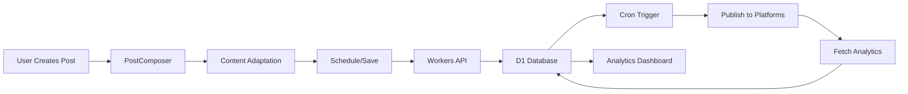

# Creator Tools MVP

> A minimal but polished content scheduling platform for creators posting to Twitter/X, LinkedIn, and Instagram with unified analytics.

## 🎯 Overview

Creator Tools MVP solves three critical pain points for content creators:

1. **Cross-platform posting takes too much time** → Schedule to multiple platforms simultaneously
2. **Inconsistent analytics across platforms** → View unified metrics in one dashboard
3. **Content adaptation for different formats** → Auto-adapt content for each platform's requirements

## ✨ Features

### Content Scheduling
- 📅 **Visual Calendar** - See your content schedule at a glance
- ✍️ **Smart Composer** - Create posts with real-time character counters for each platform
- 🔄 **Auto-Adaptation** - Automatically format content for Twitter, LinkedIn, and Instagram
- 👁️ **Live Preview** - See how your post will look on each platform before scheduling
- ⏰ **Flexible Scheduling** - Schedule posts or save as drafts

### Unified Analytics
- 📊 **Cross-Platform Dashboard** - View impressions, engagements, and reach across all platforms
- 📈 **Engagement Trends** - Track performance over time
- 🏆 **Top Posts** - Identify your best-performing content
- 🎯 **Platform Breakdown** - Compare performance across Twitter, LinkedIn, and Instagram

### Beautiful UX
- 🎨 Modern gradient design with Tailwind CSS
- 🌈 Platform-specific color coding
- ⚡ Fast and responsive interface
- 💫 Smooth transitions and animations

## 🚀 Quick Start

### Prerequisites
- Node.js 18+
- npm or yarn
- Cloudflare account (for deployment)

### Local Development

```bash
# Install dependencies
npm install

# Start development server
npm run dev

# Open http://localhost:5173
```

### Deploy to Cloudflare Pages

```bash
# Build the app
npm run build

# Deploy to Cloudflare Pages
npx wrangler pages deploy dist
```

## 🛠️ Tech Stack

### Frontend
- **React 18** - UI framework
- **TypeScript** - Type safety
- **Tailwind CSS** - Styling
- **Vite** - Build tool
- **date-fns** - Date formatting

### Backend (Cloudflare Workers)
- **Cloudflare Workers** - Serverless API
- **D1 Database** - SQLite database
- **Cron Triggers** - Scheduled post publishing
- **TypeScript** - Type-safe backend code

## 📂 Project Structure

```
creator-tools-mvp/
├── src/
│   ├── components/
│   │   ├── PostComposer.tsx       # Post creation interface
│   │   ├── ScheduleCalendar.tsx   # Calendar view
│   │   └── AnalyticsDashboard.tsx # Analytics visualization
│   ├── config/
│   │   └── platforms.ts           # Platform configurations
│   ├── services/
│   │   └── platformService.ts     # API integration service
│   ├── types/
│   │   └── index.ts               # TypeScript definitions
│   └── App.tsx                    # Main app component
├── workers/
│   └── api/
│       ├── src/
│       │   └── index.ts           # Workers API endpoints
│       ├── schema.sql             # Database schema
│       ├── wrangler.toml          # Workers configuration
│       └── package.json
└── README.md
```

## 🔧 Cloudflare Workers Setup

### 1. Create D1 Database

```bash
cd workers/api
npm install

# Create database
wrangler d1 create creator_tools_db

# Copy the database_id from output and add to wrangler.toml
```

### 2. Initialize Database Schema

```bash
wrangler d1 execute creator_tools_db --file=./schema.sql
```

### 3. Set API Secrets

```bash
# Twitter/X API
wrangler secret put TWITTER_API_KEY
wrangler secret put TWITTER_API_SECRET

# LinkedIn API
wrangler secret put LINKEDIN_CLIENT_ID
wrangler secret put LINKEDIN_CLIENT_SECRET

# Instagram API
wrangler secret put INSTAGRAM_APP_ID
wrangler secret put INSTAGRAM_APP_SECRET
```

### 4. Deploy Workers

```bash
wrangler deploy
```

### 5. Set Up Cron Trigger

The cron trigger is configured in `wrangler.toml` to run every 5 minutes and publish scheduled posts.

## 🔐 Platform API Setup

### Twitter/X API
1. Apply for access at [developer.twitter.com](https://developer.twitter.com)
2. Create an app and get API keys
3. Enable OAuth 2.0 with PKCE
4. Add callback URL: `https://api.creator-tools.com/auth/twitter/callback`

### LinkedIn API
1. Create an app at [linkedin.com/developers](https://www.linkedin.com/developers/)
2. Request access to Share on LinkedIn API
3. Get Client ID and Secret
4. Add redirect URI: `https://api.creator-tools.com/auth/linkedin/callback`

### Instagram API
1. Create a Facebook App at [developers.facebook.com](https://developers.facebook.com)
2. Add Instagram Basic Display product
3. Configure Instagram Graph API
4. Add redirect URI: `https://api.creator-tools.com/auth/instagram/callback`

## 📊 Data Flow



## 🎨 Design Philosophy

This MVP prioritizes **beautiful UX over complex features**:

- Clean, modern interface with gradient accents
- Intuitive workflows with minimal clicks
- Real-time feedback (character counters, previews)
- Platform-specific visual cues (colors, icons)
- Smooth animations and transitions

## 🚦 API Endpoints

### Posts
- `POST /api/posts` - Schedule a new post
- `GET /api/posts` - Get all scheduled posts
- `POST /api/posts/:id/publish` - Manually publish a post

### Analytics
- `GET /api/analytics` - Get unified analytics
- `GET /api/analytics/platform/:platform` - Get platform-specific analytics

### Authentication
- `GET /api/auth/twitter/callback` - Twitter OAuth callback
- `GET /api/auth/linkedin/callback` - LinkedIn OAuth callback
- `GET /api/auth/instagram/callback` - Instagram OAuth callback

## 🧪 Testing

```bash
# Run type checking
npm run type-check

# Run linter
npm run lint
```

## 📈 Roadmap

- [x] Core scheduling functionality
- [x] Multi-platform support (Twitter, LinkedIn, Instagram)
- [x] Unified analytics dashboard
- [x] Cloudflare Workers deployment
- [ ] Media upload support
- [ ] Team collaboration
- [ ] Content calendar export
- [ ] AI-powered content suggestions
- [ ] Advanced analytics (best time to post, hashtag analysis)

## 🤝 Contributing

Contributions are welcome! Please feel free to submit a Pull Request.

## 📝 License

MIT License - see LICENSE file for details

## 🙋 Support

Built by [Chris Korhonen](https://github.com/ckorhonen)

For questions or issues, please open an issue on GitHub.

---

**Note**: This is an MVP focused on core functionality and beautiful UX. Platform API integrations require valid API credentials and proper OAuth setup.
